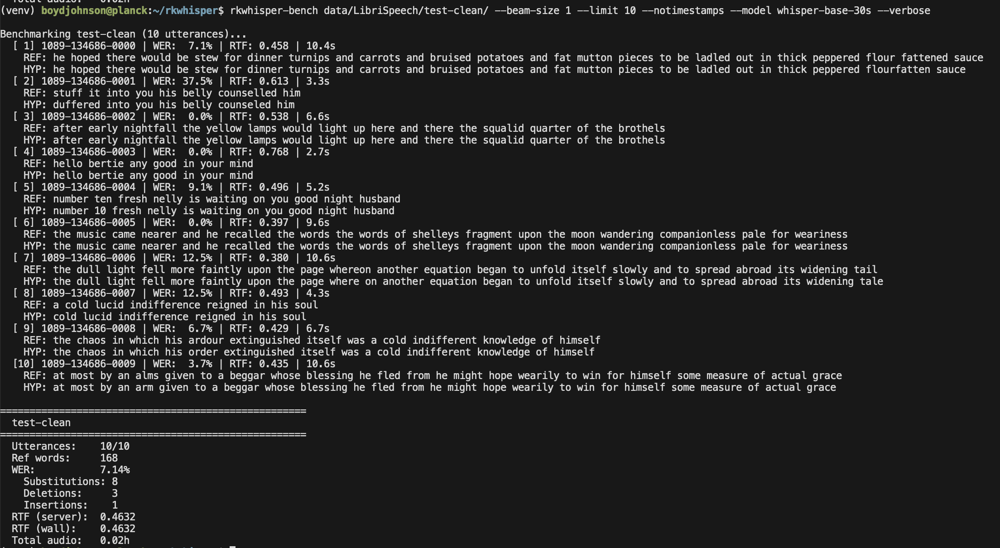

# rkwhisper

`rkwhisper` lets applications talk to a local Whisper transcription daemon
running on Rockchip NPU hardware.

The main thing this repo gives you is client access:

- A Rust client crate in [`rkwhisper-client`](rkwhisper-client)
- A Python client package in [`rkwhisper-python`](rkwhisper-python)
- A shared Unix socket protocol in [`rkwhisper-protocol`](rkwhisper-protocol)
- A daemon, `rkwhisperd`, that keeps models warm and serves transcription jobs

The daemon is the hardware-facing part. Your app sends 16 kHz mono PCM audio to
the daemon over a Unix socket, then receives transcript segments as they are
decoded.



## Who This Is For

Use `rkwhisper` when you want local speech-to-text on Rockchip boards without
embedding RKNN model management, shared-memory audio transport, and multi-NPU
scheduling inside every application.

The clients are designed for:

- Batch transcription of short clips
- Live or incremental transcription from an app
- Async applications that need to send audio and receive segments concurrently
- Benchmarking transcription speed and real-time factor on target hardware

## Repository Layout

```text
rkwhisper-client/     Rust client crate
rkwhisper-python/     Python client package backed by Rust/PyO3
rkwhisper-protocol/   Shared protocol types and framing
rkwhisper/            Daemon and lower-level transcription pipeline
rkwhisper-bench/      Python benchmark CLI
proto/                Protocol schema
```

## Requirements

Runtime transcription requires:

- Rockchip hardware and runtime support compatible with `rknpu2`
- RKNN model files for the Whisper model you want to serve
- A Whisper `tokenizer.json`
- A VAD RKNN model
- Audio input as 16 kHz mono signed 16-bit PCM

Development requires Rust with edition 2024 support. The Python package uses
`maturin`.

## Start The Daemon

The clients connect to `rkwhisperd`, so start there.

## Model Files

Model files live in a separate repository:
[`boundarybitlabs/rkwhisper-models`](https://github.com/boundarybitlabs/rkwhisper-models).

Download prebuilt model bundles from the
[`rkwhisper-models` releases page](https://github.com/boundarybitlabs/rkwhisper-models/releases).

Create model directories under `/usr/share/rkwhisper` or set
`RKWHISPER_MODEL_ROOT` to another location:

```text
/usr/share/rkwhisper/whisper-small-30s/
  tokenizer.json
  mel.rknn
  encoder.rknn
  enc_kv.rknn
  decoder.rknn
  vad.rknn
```

Create a daemon config:

```toml
# /etc/rkwhisper.toml
models = [
  "whisper-small-30s",
]

[concurrency]
model_queue_depth = 1
max_active_jobs_per_model = 1
max_in_flight_windows_per_job = 1
client_window_queue_depth = 4
client_response_queue_depth = 16
```

Run the daemon:

```sh
cargo run --release --bin rkwhisperd
```

Defaults:

- Config: `/etc/rkwhisper.toml`
- Model root: `RKWHISPER_MODEL_ROOT` or `/usr/share/rkwhisper`
- Socket: `/run/rkwhisper/asr.sock`

Override paths when developing:

```sh
cargo run --release --bin rkwhisperd -- \
  --config ./rkwhisper.toml \
  --model-root /models/rkwhisper \
  --socket /tmp/rkwhisper.sock
```

## Rust Client

The Rust client exposes sync and async sessions. It handles the daemon handshake,
shared audio ring setup, response decoding, cancellation, and backoff retries.

Add the local crate while developing in this workspace:

```toml
[dependencies]
rkwhisper-client = { path = "rkwhisper-client" }
tokio = { version = "1", features = ["macros", "rt-multi-thread"] }
anyhow = "1"
```

Connect and stream audio asynchronously:

```rust
use rkwhisper_client::{ClientHello, Response, asynchronous::Session};

#[tokio::main]
async fn main() -> anyhow::Result<()> {
    let hello = ClientHello {
        model: "whisper-small-30s".to_string(),
        client_id: "my-rust-app".to_string(),
        ..ClientHello::default()
    };

    let session = Session::connect("/run/rkwhisper/asr.sock", hello).await?;
    let (mut sender, mut receiver) = session.split();

    let samples = vec![0.0f32; 16_000];
    let pcm_bytes = rkwhisper_client::samples_to_pcm(&samples);

    let send_task = tokio::spawn(async move {
        sender.send_audio(&pcm_bytes).await?;
        sender.finish().await?;
        Ok::<_, rkwhisper_client::Error>(())
    });

    while let Ok(response) = receiver.recv_response().await {
        match response {
            Response::Segment { text, begin, end } => {
                println!("{begin:.2}-{end:.2}: {text}");
            }
            Response::Done { audio_s, rtf } => {
                println!("done: {audio_s:.2}s audio, {rtf:.3} RTF");
                break;
            }
            _ => {}
        }
    }

    send_task.await??;
    Ok(())
}
```

See [`rkwhisper-client/examples/async_client.rs`](rkwhisper-client/examples/async_client.rs)
for a complete runnable example.

## Python Client

The Python client provides sync and async sessions with the same shape as the
Rust client. It is useful for applications, scripts, and benchmark tooling that
need to stream audio without writing the protocol directly.

Install for local development:

```sh
cd rkwhisper-python
maturin develop
```

Use the synchronous API:

```python
from rkwhisper_client import ClientHello, Done, Segment, SyncSession

hello = ClientHello(
    model="whisper-small-30s",
    mode="stream",
    client_id="my-python-app",
)

with SyncSession.connect("/run/rkwhisper/asr.sock", hello) as session:
    sender, receiver = session.split()

    pcm_bytes = b"\x00\x00" * 16_000
    sender.send_audio(pcm_bytes)
    sender.finish()

    for response in receiver:
        if isinstance(response, Segment):
            print(f"{response.begin:.2f}-{response.end:.2f}: {response.text}")
        elif isinstance(response, Done):
            print(f"done: {response.audio_s:.2f}s audio, {response.rtf:.3f} RTF")
            break
```

For live audio, send from one thread or task and receive from another. The
`split()` API exists so audio transmission and response handling do not block
each other.

The standalone [`pywhisper-client.py`](pywhisper-client.py) script demonstrates
the same client flow from the command line.

## Benchmarking

`rkwhisper-bench` measures transcription quality and speed against LibriSpeech
audio. It uses the Python client to talk to a running `rkwhisperd` instance.

```sh
cd rkwhisper-bench
python -m rkwhisper_bench.cli --help
```

The screenshot above shows the benchmark output style: word error rate, audio
duration, wall time, and real-time factor across a run.

## Supported Models

The daemon expects model directory names to match the requested model id.

Supported ids:

- `whisper-tiny-30s`
- `whisper-base-30s`
- `whisper-small-30s`

## Client Options

Clients send a `ClientHello` when opening a session. Defaults are:

- `mode`: `batch`
- `lang`: `en`
- `task`: `transcribe`
- `max_new_tokens`: `128`
- `beam_size`: `5`
- `notimestamps`: `false`
- `suppress_tokens`: `default`
- audio format: 16 kHz, mono, signed 16-bit PCM

VAD can be configured per session:

- `vad_threshold`
- `vad_min_speech_ms`
- `vad_min_silence_ms`
- `vad_speech_pad_ms`
- `vad_window_samples`

## Protocol Reference

`rkwhisperd` uses a v1 Unix socket protocol with Protobuf control messages and
shared-memory PCM transfer. Client libraries handle this for normal use.

Connection flow:

1. The client sends a length-prefixed `ClientHello`.
2. The server validates that the requested audio format is 16 kHz mono s16le.
3. The server creates a 30-second audio ring buffer in a `memfd`.
4. The server sends the `memfd` to the client with `SCM_RIGHTS`.
5. The server sends a length-prefixed `ServerHello`.
6. The client writes s16le PCM bytes into the shared ring and sends socket
   signals.
7. The server replies with `segment`, `done`, `cancelled`, `back_off`, or
   `error` responses.

Signal bytes:

- `0x01`: data ready
- `0x02`: end of stream
- `0x03`: cancel

The checked-in schema is [`proto/rkwhisper.proto`](proto/rkwhisper.proto).

## How It Works

Audio is split into fixed 30-second windows or VAD-derived speech windows. Each
window is converted to log-mel features, encoded, converted into encoder
cross-attention K/V tensors, and decoded token by token.

In multi-NPU mode, each worker owns a full RKNN context set pinned to one RK3588
NPU core. Tokio coordinates ready workers, dispatches pending windows, and
reorders completed results by window index.

## License

Apache-2.0. See [`LICENSE`](LICENSE).
